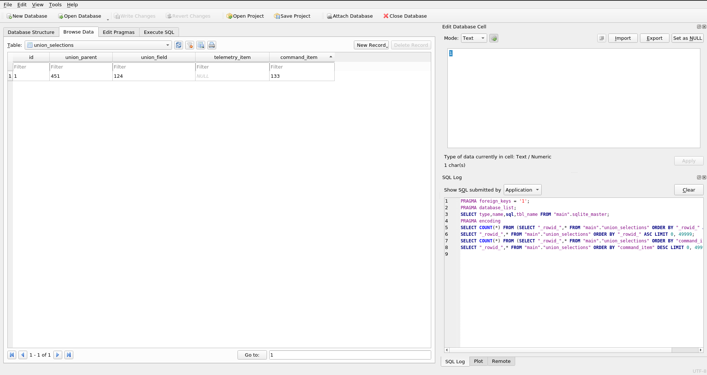
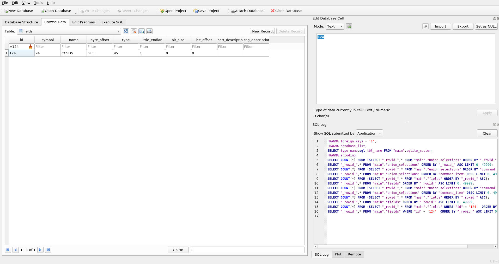

# Union Mapper

This tool maps unions generated by [juicer](https://github.com/WindhoverLabs/juicer) via YAML.
It is assumed that the SQLITE DB has been processed by [tlm_cmd_merger](https://github.com/WindhoverLabs/tlm_cmd_merger).

For example; suppose we have the following struct:

```C
union CFE_MSG_Message
{
    CCSDS_SpacePacket_t CCSDS;                             /**< \brief CCSDS Header (Pri or Pri + Ext) */
    uint8               Byte[sizeof(CCSDS_SpacePacket_t)]; /**< \brief Byte level access */
};

typedef union CFE_MSG_Message CFE_MSG_Message_t;

struct CFE_MSG_CommandHeader
{
    CFE_MSG_Message_t                Msg; /**< \brief Base message */
    CFE_MSG_CommandSecondaryHeader_t Sec; /**< \brief Secondary header */
};

typedef struct CFE_MSG_CommandHeader CFE_MSG_CommandHeader_t;

typedef struct
{
    CFE_MSG_CommandHeader_t CommandHeader; /**< \brief cFE Software Bus command message header */

    CFE_SB_MsgId_t MessageID; /**< \brief Message ID to add to Packet Filter Table */
} DS_AddRemoveMid_Payload_t;

/**
 *  \brief Add Message ID To Packet Filter Table
 *
 *  For command details see #DS_ADD_MID_CC
 */
typedef struct
{
    CFE_MSG_CommandHeader_t CommandHeader; /**< \brief cFE Software Bus command message header */

    DS_AddRemoveMid_Payload_t Payload;
} DS_AddMidCmd_t;
****
```

Notice that in this case the field `Msg` is a union. Users can select which union field to select 
from YAML:
```YAML
      ds:
        app_name: DS
        commander:
          displays: cdr
        commands:
          DS_CMD_MID:
            commands:
              DS_AddMessage:
                cc: 16
                struct: DS_AddMidCmd_t
                union_select:
                   .Payload.CommandHeader.Msg: CCSDS
```

After running the tool:
```commandline
python3 union_mapper.py --sqlite_path ./cosmology.db --yaml_path ./registry.yaml
```

The table "union_selections" will be added to the sqlite db, which will include all the union associations listed 
in the YAML:




Any consumer(e.g. [auto-yamcs](https://github.com/WindhoverLabs/auto-yamcs)) can read the `union_selections` table and
find all the union associations for all telemetry and command items.


    